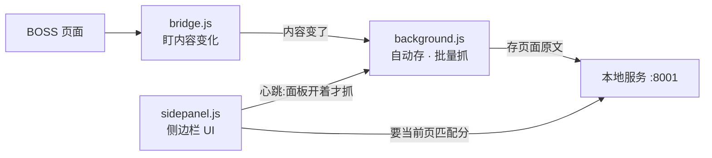
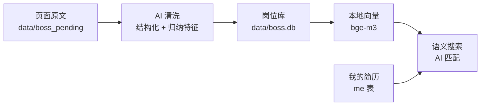

# Aiboss

把你在 BOSS 直聘上**看过的岗位**变成本机知识库：自动存 → AI 清洗 → 语义搜索，
再把**岗位原文和你的简历一起交给大模型**，当场给出匹配分和依据。

> 边逛边建库：开着插件侧边栏浏览 BOSS，看到一个岗位详情页，
> 面板上就出一个 0-100 的匹配分 —— 首次约 6-8 秒，之后同一岗位秒出。

**完全自部署。** 岗位库、简历、向量全在你机器上；唯一出机器的是
「岗位 JD + 你的简历」发给你自己配的大模型 API（通义千问 / DeepSeek /
智谱 / 本地 Ollama 都行）。本项目没有服务器，也不收集任何数据。


> ⚠️ **仅供个人自用,请勿商用。** 详见文末[使用限制与免责声明](#使用限制与免责声明)。
---

## 长什么样

### 一边逛,一边出匹配度


逛 BOSS 的时候侧边栏就在旁边:**当前岗位的四项硬门槛核对 + 模型给的匹配分**一眼看到,
岗位原文自动进库 —— 不用你复制粘贴,也不用记着回来整理。面板关掉就完全停止抓取。

### 攒下来的岗位:管理 · 匹配 · 看清市场和自己


看过的每个岗位都留在库里,可以逐个对照分析:**左边挑一个,右边给出
「哪几项硬门槛不符」「技能哪些对得上、缺什么」「最可能被挑什么」**,
每条判断都带原文出处,引不出原文的直接丢弃并计数(截图里那个「5/14 条已丢弃」)。

攒够几十上百个之后,这个库能回答两个平时很难回答的问题:
**市场反复在要求什么**(所以我该补什么)、**我到底卡在哪一环**
(城市?薪资?还是某类经验)—— 语义搜索 + 逐条对照,比凭印象靠谱。

---


## 架构

分两块:**插件**只管在浏览器里把页面原文捞出来送到本机;**知识库**在本机做清洗、
向量、匹配。两块之间只有一条 HTTP 线(localhost:8001),换掉任何一块都不影响另一块。

### 一、插件(浏览器里)



- **面板开着才抓**:侧边栏每 8 秒写一次心跳,后台据此判断抓不抓 —— 关掉面板就全停。
- **三种页面变化都听**:整页加载、SPA 换 URL、左右分栏点左边(URL 不变,靠内容指纹)。
- **只发 localhost**,不往任何别的地方发数据。

### 二、知识库(本机服务)



- **原文永不删**:清洗口径以后会改,原文在就能重来。
- **向量在本机算**(bge-m3),岗位库不出机器;**唯一出机器的**是清洗和匹配时
  发给你自己配的大模型的那两段(页面原文 / JD + 简历)。
- **匹配 = 机械 + 模型**:城市/经验/学历/薪资是你的底线,机械核对、模型改不了;
  技能等价、职责对不对路交给模型判。

---

## 快速开始

你只需要自己准备**两样东西**:一把大模型 API key(通义千问 / DeepSeek / 智谱…;
用本地 Ollama 则不需要 key)和 Chrome 浏览器。
**Python 环境、依赖、向量模型、数据库建表全是自动的** —— 不用你装、不用你下。

### 第 1 步 · 你做:一条命令

```bash
git clone https://github.com/HansonY/Aiboss.git && cd Aiboss
./boss.sh
```

**接着自动发生**(首次约几分钟):挑一个 Python 3.10–3.13 → 建 `.venv` →
装依赖(约 1 GB,大头是 torch)→ 建数据库 → 起服务。
终端打出 `Aiboss → http://localhost:8001` 就成了。之后再跑就直接起服务。

> 想用自己的 Python:`PYTHON=/path/to/python ./boss.sh`。
> 3.14 装不上 pydantic-core,脚本会拦下并告诉你怎么办。

### 第 2 步 · 你做:装插件

`chrome://extensions` → 右上角开「开发者模式」→「加载已解压的扩展程序」→ 选仓库里的
`extension/` 目录。**这步没法自动**(Chrome 只允许手动加载商店外的插件)。

### 第 3 步 · 你做:配一把 AI key

打开 http://localhost:8001 → 点右上角「AI …」→ 选供应商 → 粘 key → 点「测一下」。
key 只写进本机 `.env`(权限 0600),页面永远只显示尾四位。

### 第 4 步 · 你做:粘一次简历

打开 `/me.html`,把简历正文整段粘进去,点「AI 提取特征」。
**接着自动**:抽出年限/学历/期望城市/薪资底线并**直接生效**,没有「保存」这一步。
抽不出来的项会用虚线框标出来,你可以补全(填完自动存)。

### 第 5 步 · 你做:开着侧边栏逛 BOSS

在 BOSS 页面点开插件侧边栏,然后正常找工作。
**接着自动**:你看过的岗位页原文进入待提取队列;**岗位详情页会当场显示硬门槛核对结果**,
想要模型打分就点一下「AI 分析匹配」(不自动花钱)。

### 第 6 步 · 你做:点一次「提取」

回到 http://localhost:8001 →「待提取」标签 → 勾选 → 点「提取」。
**接着自动**:AI 清洗成结构化 + 归纳特征入库,**然后自动触发向量同步**。

> ⚠️ **向量模型就是在这一步第一次自动下载的**(约 2.2 GB,几分钟,取决于网速)。
> 不需要你做任何事;页面「向量」那格会实时显示下载和嵌入进度。
> 下完永久缓存在 `~/.cache/huggingface`,以后不再下。

### 之后就是日常

浏览岗位 → 面板出分 · 岗位库页语义搜索 · 岗位匹配页看完整对照。
详见下面的「日常流程」。

## 向量模型(自动下载,不用你管)

语义搜索用 **BAAI/bge-m3**,**在你的机器上跑**,岗位和简历不出本机。
但模型权重要从 HuggingFace 下载一次 —— 这是**唯一一次**大文件下载,全自动:

| | |
|---|---|
| 什么时候下 | 第一次提取后的自动向量同步(或你手动 `./boss.sh index`) |
| 要你做什么 | **不用做任何事**,页面上能看到进度 |
| 下载大小 | 约 **2.2 GB** 权重 |
| 缓存在哪 | `~/.cache/huggingface` —— 全局共享,重装项目不用重下 |
| 首次加载 | 约 **14 秒**;之后常驻,单次查询编码 **~120ms** |
| 常驻内存 | 约 **1 GB** |

- 国内网络慢:先 `export HF_ENDPOINT=https://hf-mirror.com` 再跑。
- **不想要语义搜索也行**:不碰搜索、不点建索引就不会下载 ——
  提取入库和 AI 匹配照常用(那两个只走你配的大模型 API)。

## 它能做什么

| | 怎么做的 |
|---|---|
| **自动建库** | 插件只读**你已经打开的页面**的文字（innerText），不解析接口、不带 cookie 出浏览器。面板开着才抓，关掉全停 |
| **AI 清洗** | 页面原文 → 结构化（岗位/公司/薪资/JD 原文），顺手归纳四个特征：办公方式（远程/混合/现场）、业务领域、技术主线、一句卖点 |
| **语义搜索** | 清洗后的岗位连同特征转向量（本地 bge-m3，数据不出机器）。搜「全职远程的 AI 应用开发」是按**意思**搜,不是关键词 |
| **AI 匹配** | 四个硬门槛（城市/经验/学历/薪资）机械核对,**其余全由模型判**：技能匹配含等价经历（简历写「从 0 到上线」= 岗位要的「独立开发且上线经验」——词表永远对不出这个） |
| **防幻觉** | 模型的每条判断必须**逐字引用**JD 或简历原文,引不出的直接丢弃并计数显示。分数落库,不会刷新一次变一个数 |

## 三个页面

| 页面 | 干什么 |
|---|---|
| `/` 岗位库 | 左列表右内容;顶上搜索框是**语义过滤**;「待提取」标签里勾选提取 |
| `/me.html` 我的简历 | 粘原文 → AI 提取特征(直接生效);空项可补全 |
| `/match.html` 岗位匹配 | 硬门槛四态 + 模型完整分析(技能对得上/缺口/风险/隐性要求) |

插件侧边栏:浏览时出当前岗位的门槛核对 + 「AI 分析匹配」按钮;关掉面板即停止抓取。

## 设计立场(为什么这么做)

- **机械的和模型的,泾渭分明。** 城市/薪资底线这类**你的底线**机械核对,
  模型改不了(它看到「差一点但机会难得」会心软);职责对不对路、技能等价
  这类**读原文才能判的**全归模型,不做机械词表对照 —— 词表会对一个
  iOS 开发说「你缺 ios」。
- **模型输出必须可验证。** 每条判断带原文引用,程序逐字校验,引不出的丢弃并
  把丢弃数印在页面上 —— 它高了说明模型在编,除了这个数没别的地方看得出来。
- **「没有」和「还不知道」分开。** 没抓到职位描述 ≠ 岗位没写;门槛数据缺失
  判「未判定」,不判「不合格」。混成一个布尔之后,「该去补数据还是该认命」
  谁也说不清。
- **原文永不删。** 页面原文、简历原文、模型原始输出都整份留着 ——
  提取口径以后一定会改,原文在就能重来。

## 说清楚的边界

- **「批量抓取 / 自动翻页」会产生你没有亲手点过的请求**（逐个打开列表里的岗位）。
  它必须手动点按钮才开始、4–9 秒随机间隔、连错三次自动停、随时可停。
  纯被动模式（只存你自己点开的页面）不产生任何额外请求。
- 匹配分是**模型给的参考**,不是客观事实;规则核对和模型结论并排显示,
  两者冲突时页面会标出来,不做静默调和。
- 库里的岗位都经过你的搜索词和点击 —— 是**自选样本**,别当市场全貌。

## 命令行

```bash
./boss.sh                  # 起服务(默认)
./boss.sh find 远程 AI 岗   # 命令行语义检索(不需要任何 key)
./boss.sh ask 哪些岗位要音视频经验    # 基于库回答,强制带出处
./boss.sh index-status     # 向量索引现状
./boss.sh llmtest          # 测 AI 配置通不通
```

## 仓库长什么样

```
boss.sh              唯一入口:起服务、建索引、命令行检索
requirements.txt     依赖清单
extension/           Chrome 插件(未打包加载)
backend/
  boss_main.py       所有 HTTP 接口
  boss_extract.py    页面原文 → 结构化 + 归纳特征
  boss_match.py      机械核对:城市/经验/学历/薪资
  boss_matchai.py    模型匹配 + quote 逐字校验
  boss_resume.py     简历原文 → 结构化
  kb/                向量内核(业务无关:片段→向量→检索→问答)
  db/                SQLite 存取 + schema
  static_boss/       三个页面:岗位库 / 我的简历 / 岗位匹配
scripts/             建索引、口径自检
data/                你的库(已 gitignore,不进仓库)
```

## 技术栈

FastAPI + SQLite（sqlite-vec）+ bge-m3 本地向量 + 任意 OpenAI 兼容 LLM。
Chrome 插件 MV3（side panel）。无框架前端。

---

## 使用限制与免责声明

**这是一个个人自用的开源工具,请勿商用。**

- **仅供个人学习与自用。** 请勿用于商业目的,也不要拿它对外提供服务、
  批量代抓或转售数据。
- **数据全在你自己机器上。** 本项目没有服务器,作者接触不到任何人的数据;
  岗位库、简历、API key 都只在本地(`data/` 与 `.env`,均已 gitignore)。
- **抓取行为请自行把握。** 插件默认只读**你已经打开**的页面;
  「批量抓取 / 自动翻页」会产生你没有亲手点过的请求(已内置 4–9 秒随机间隔、
  连错三次自动停),**是否使用、以什么频率使用由你决定** ——
  请遵守目标网站的用户协议与 robots 规则,由此产生的账号风险由使用者自行承担。
- **匹配分只是参考。** 它是大模型的判断,不是客观事实,不构成任何求职、
  投递或雇佣建议;库里的岗位全部经过你自己的搜索词和点击,是**自选样本**,
  不代表市场全貌。
- **与平台无关。** 本项目与 BOSS 直聘及其运营方无任何关联,
  未获其授权、许可或背书;相关商标归各自所有者。
- **不作任何担保。** 软件按「现状」提供,作者不对使用本项目造成的任何
  直接或间接损失承担责任。

