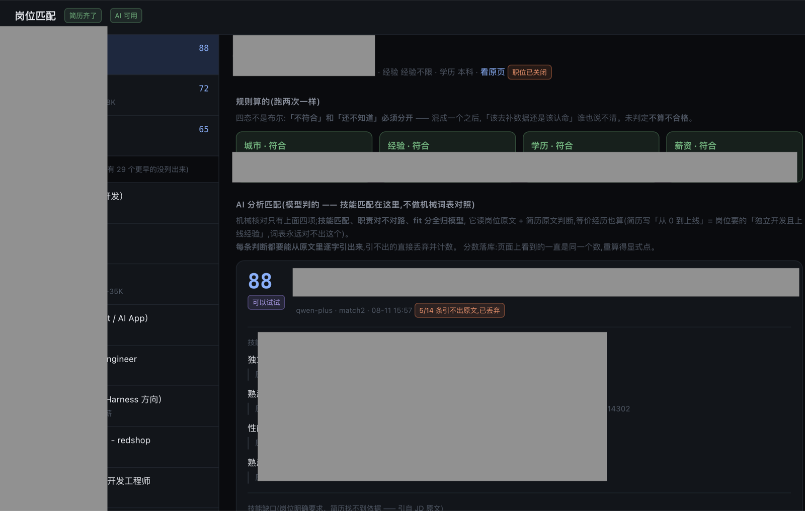
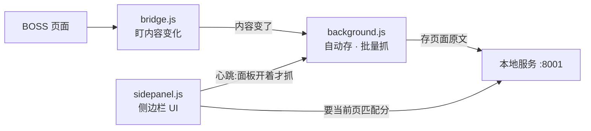
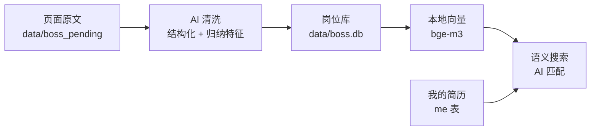

# Aiboss

把你在 BOSS 直聘上**看过的岗位**变成本机知识库：自动存 → AI 清洗 → 语义搜索，
再把**岗位原文和你的简历一起交给大模型**，当场给出匹配分和依据。

> ⚠️ **仅供个人自用，请勿商用。** 详见文末[使用限制与免责声明](#使用限制与免责声明)。

---

## 长什么样

**一边逛，一边出匹配度**


侧边栏就在旁边：当前岗位的**四项硬门槛核对 + 模型给的匹配分**一眼看到，
岗位原文自动进库 —— 不用复制粘贴，也不用记着回来整理。关掉面板就完全停止抓取。

**攒下来的岗位：管理 · 匹配 · 看清市场和自己**



左边挑一个，右边给出「哪几项硬门槛不符」「技能哪些对得上、缺什么」「最可能被挑什么」，
每条判断都带原文出处。攒够几十上百个之后，这个库能回答两个平时很难回答的问题：
**市场反复在要求什么**、**我到底卡在哪一环**。

---

## 开始用（两步）

**① 一条命令**

```bash
git clone https://github.com/HansonY/Aiboss.git && cd Aiboss
./boss.sh
```

首次会自动建好一切（Python 环境 → 依赖 → 数据库 → 起服务，约几分钟）。
终端打出 `Aiboss → http://localhost:8001` 就成了，之后再跑就是直接起服务。

**② 装插件**

`chrome://extensions` → 开「开发者模式」→「加载已解压的扩展程序」→ 选仓库里的
`extension/` 目录。

打开 <http://localhost:8001> —— **配 AI key、粘简历都在页面上，跟着提示走**。
然后去 BOSS 页面点开插件侧边栏，正常找工作就行。

---

## 能做什么

| | 怎么做的 |
|---|---|
| **自动建库** | 插件只读你**已经打开**的页面文字，不解析接口、不带 cookie 出浏览器；面板开着才抓 |
| **AI 清洗** | 页面原文 → 结构化（岗位/公司/薪资/JD），顺手归纳办公方式、业务领域、技术主线、一句卖点 |
| **语义搜索** | 清洗后连同特征转向量（本地 bge-m3）。搜「全职远程的 AI 应用开发」是按**意思**搜 |
| **AI 匹配** | 四个硬门槛机械核对，**其余全由模型判** —— 技能匹配含等价经历（「从 0 到上线」= 岗位要的「独立开发且上线经验」，词表永远对不出） |
| **防幻觉** | 模型每条判断必须**逐字引用**原文，引不出的直接丢弃并把丢弃数显示出来；分数落库，不会刷新一次变一个数 |

三个页面：`/` 岗位库（搜索 + 提取）· `/me.html` 我的简历 · `/match.html` 岗位匹配。

---

## 架构

分两块。插件只管在浏览器里把页面原文捞出来送到本机；知识库在本机做清洗、向量、匹配。
两块之间只有一条 HTTP 线（localhost:8001）。

**一、插件（浏览器里）**



**二、知识库（本机服务）**



---

## 需要知道的几件事

- **向量模型自动下载。** 第一次提取后自动同步向量，这时从 HuggingFace 下一次
  `BAAI/bge-m3`（约 2.2 GB，缓存在 `~/.cache/huggingface`，以后不再下），页面上能看到进度。
  国内慢可先 `export HF_ENDPOINT=https://hf-mirror.com`；不用语义搜索就不会触发下载。
- **数据全在本机。** 岗位库、简历、API key 在 `data/` 和 `.env`（都已 gitignore）——
  每个人拉代码跑的都是自己的库。唯一出机器的是清洗和匹配时发给**你自己配的**大模型的内容。
- **用自己的 Python**：`PYTHON=/path/to/python ./boss.sh`（需要 3.10–3.13）。
- **命令行**：`./boss.sh find <关键词>` 语义检索 · `ask <问题>` 带出处问答 ·
  `index-status` 索引现状 · `llmtest` 测 AI 配置。

## 为什么这么设计

- **机械的和模型的分开。** 城市/薪资底线是**你的底线**，机械核对、模型改不了（它看到
  「差一点但机会难得」会心软）；职责对不对路、技能等价这类读原文才能判的全归模型。
- **模型输出必须可验证。** 每条判断带原文引用、程序逐字校验，引不出的丢弃并把丢弃数印出来
  —— 它高了说明模型在编，除此之外没地方看得出来。
- **「没有」和「还不知道」分开。** 门槛数据缺失判「未判定」，不判「不合格」。
- **原文永不删。** 提取口径以后一定会改，原文在就能重来。

---

## 使用限制与免责声明

**这是一个个人自用的开源工具，请勿商用。**

- **仅供个人学习与自用**，请勿用于商业目的，也不要拿它对外提供服务、批量代抓或转售数据。
- **抓取行为请自行把握。** 插件默认只读你**已经打开**的页面；「批量抓取 / 自动翻页」
  会产生你没有亲手点过的请求（已内置 4–9 秒随机间隔、连错三次自动停），
  是否使用、以什么频率使用由你决定 —— 请遵守目标网站的用户协议与 robots 规则，
  由此产生的账号风险由使用者自行承担。
- **匹配分只是参考。** 它是大模型的判断，不是客观事实，不构成任何求职或雇佣建议；
  库里的岗位全部经过你自己的搜索词和点击，是**自选样本**，不代表市场全貌。
- **与平台无关。** 本项目与 BOSS 直聘及其运营方无任何关联，未获其授权、许可或背书；
  相关商标归各自所有者。
- **不作任何担保。** 软件按「现状」提供，作者不对使用本项目造成的任何直接或间接损失承担责任。

---

技术栈：FastAPI + SQLite（sqlite-vec）+ bge-m3 本地向量 + 任意 OpenAI 兼容 LLM；
Chrome 插件 MV3（side panel）；无框架前端。目录结构见 [docs/LAYOUT.md](docs/LAYOUT.md)。

MIT License
