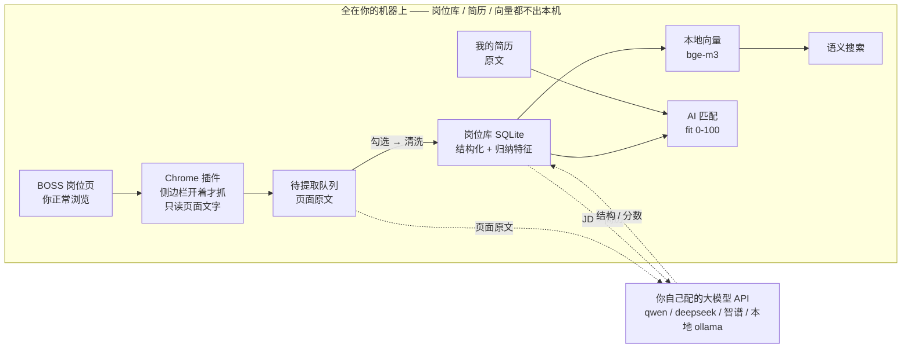
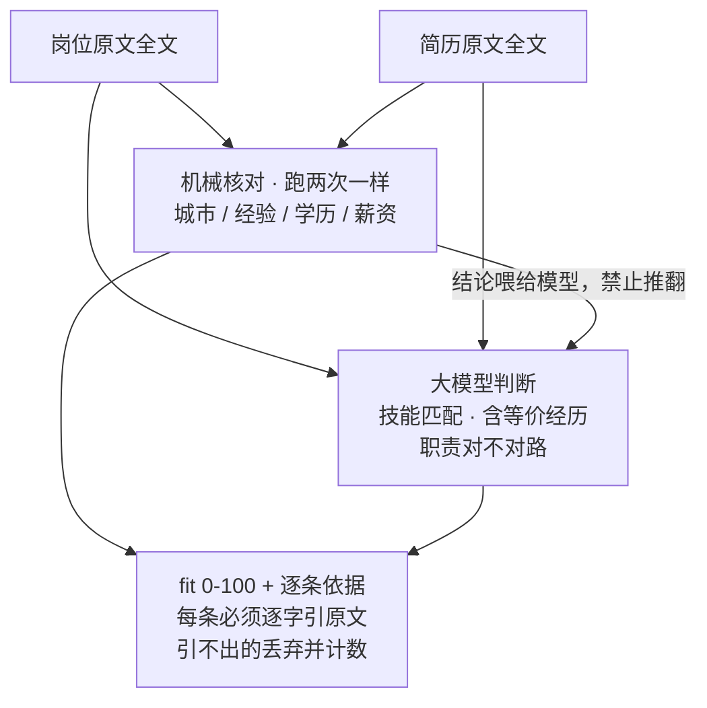

# Aiboss

把你在 BOSS 直聘上**看过的岗位**变成本机知识库：自动存 → AI 清洗 → 语义搜索，
再把**岗位原文和你的简历一起交给大模型**，当场给出匹配分和依据。

> 边逛边建库：开着插件侧边栏浏览 BOSS，看到一个岗位详情页，
> 面板上就出一个 0-100 的匹配分 —— 首次约 6-8 秒，之后同一岗位秒出。

**完全自部署。** 岗位库、简历、向量全在你机器上；唯一出机器的是
「岗位 JD + 你的简历」发给你自己配的大模型 API（通义千问 / DeepSeek /
智谱 / 本地 Ollama 都行）。本项目没有服务器，也不收集任何数据。

---

## 架构

一条岗位从「你在浏览」到「能搜、能匹配」：



虚线是**唯一出本机的两条**：清洗时把页面原文、匹配时把 JD + 简历，发给你自己配的模型。
其余全部留在 `data/`（已 gitignore，每个人跑自己的库）。

匹配分怎么来的 —— 机械的和模型的泾渭分明：



**你的底线（城市 / 薪资 / 年限 / 学历）机械核对，模型改不了** —— 模型看到「差一点但机会难得」
会心软，底线不该有弹性。**其余全归模型**：技能匹配要判等价经历（简历写「从 0 到上线」
= 岗位要的「独立开发且上线经验」，词表永远对不出这个），所以不做机械词表对照。

## 它能做什么

| | 怎么做的 |
|---|---|
| **自动建库** | 插件只读**你已经打开的页面**的文字（innerText），不解析接口、不带 cookie 出浏览器。面板开着才抓，关掉全停 |
| **AI 清洗** | 页面原文 → 结构化（岗位/公司/薪资/JD 原文），顺手归纳四个特征：办公方式（远程/混合/现场）、业务领域、技术主线、一句卖点 |
| **语义搜索** | 清洗后的岗位连同特征转向量（本地 bge-m3，数据不出机器）。搜「全职远程的 AI 应用开发」是按**意思**搜,不是关键词 |
| **AI 匹配** | 四个硬门槛（城市/经验/学历/薪资）机械核对,**其余全由模型判**：技能匹配含等价经历（简历写「从 0 到上线」= 岗位要的「独立开发且上线经验」——词表永远对不出这个） |
| **防幻觉** | 模型的每条判断必须**逐字引用**JD 或简历原文,引不出的直接丢弃并计数显示。分数落库,不会刷新一次变一个数 |

## 快速开始

```bash
git clone https://github.com/HansonY/Aiboss.git && cd Aiboss
./boss.sh          # 首次自动建环境(含 torch,几分钟),然后起 http://localhost:8001
```

1. **装插件**：`chrome://extensions` → 开发者模式 → 「加载已解压的扩展程序」→ 选 `extension/` 目录
2. **配 AI**：打开 http://localhost:8001 → 点右上角「AI …」→ 选供应商、粘 key、测一下
   （key 只写进本机 `.env`，页面永远只显示尾四位）
3. **录简历**：`/me.html` 粘一次简历原文 → AI 抽结构化 → 逐项核对
4. **开逛**：BOSS 页面上点开插件侧边栏，正常浏览 —— 岗位自动进库，
   详情页点「AI 分析匹配」出分

## 日常流程

```
逛 BOSS(侧边栏开着)──自动存原文──→ 待提取队列
              └─ 岗位详情页:硬门槛自动核对 + 点「AI 分析匹配」→ 出分
网页(:8001):勾选 → 看预计耗时 → 提取(清洗+特征)──自动──→ 转向量
                                            └──→ 语义搜索,结果带匹配分
```

## 设计立场(为什么这么做)

- **机械的和模型的,泾渭分明。** 城市/薪资底线这类**你的底线**机械核对,
  模型改不了(它看到「差一点但机会难得」会心软);职责对不对路、技能等价
  这类**读原文才能判的**全归模型,不做机械词表对照 —— 词表会对一个
  iOS 开发说「你缺 ios」。
- **模型输出必须可验证。** 每条判断带原文引用,程序逐字校验,引不出的丢弃并
  把丢弃数印在页面上 —— 它高了说明模型在编,除了这个数没别的地方看得出来。
- **「没有」和「还不知道」分开。** 没抓到职位描述 ≠ 岗位没写;门槛数据缺失
  判「未判定」,不判「不合格」。混成一个布尔之后,「该去补数据还是该认命」
  谁也说不清。
- **原文永不删。** 页面原文、简历原文、模型原始输出都整份留着 ——
  提取口径以后一定会改,原文在就能重来。

## 说清楚的边界

- **「批量抓取 / 自动翻页」会产生你没有亲手点过的请求**（逐个打开列表里的岗位）。
  它必须手动点按钮才开始、4–9 秒随机间隔、连错三次自动停、随时可停。
  纯被动模式（只存你自己点开的页面）不产生任何额外请求。
- 匹配分是**模型给的参考**,不是客观事实;规则核对和模型结论并排显示,
  两者冲突时页面会标出来,不做静默调和。
- 库里的岗位都经过你的搜索词和点击 —— 是**自选样本**,别当市场全貌。

## 命令行

```bash
./boss.sh                  # 起服务(默认)
./boss.sh find 远程 AI 岗   # 命令行语义检索(不需要任何 key)
./boss.sh ask 哪些岗位要音视频经验    # 基于库回答,强制带出处
./boss.sh index-status     # 向量索引现状
./boss.sh llmtest          # 测 AI 配置通不通
```

## 技术栈

FastAPI + SQLite（sqlite-vec）+ bge-m3 本地向量 + 任意 OpenAI 兼容 LLM。
Chrome 插件 MV3（side panel）。无框架前端。

MIT License
